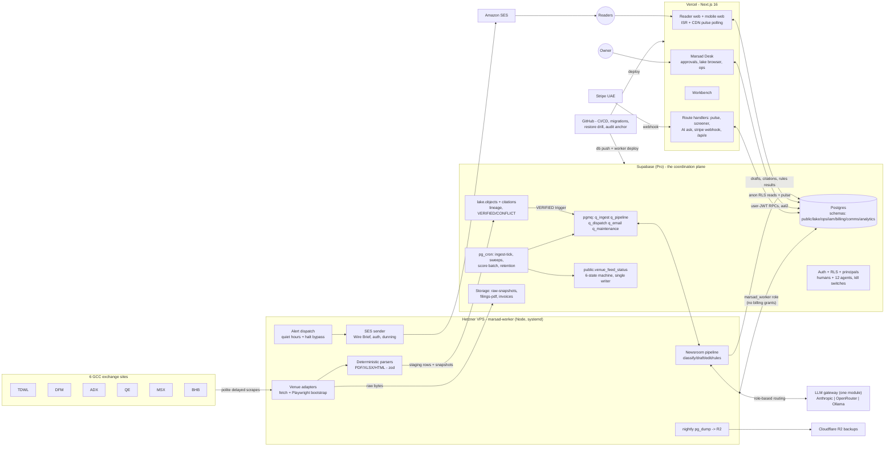

# 00 — Marsad Master Plan

> The definitive build plan for the Marsad platform, finalized by the chief architect after
> adversarial review of all six domain documents (01–06). Every cross-domain conflict found in
> review is resolved; each domain doc carries a "Revisions (post-review)" section recording
> what changed and why. **Precedence:** this document → 06 (placement & cost) → 02 (all table
> names & DDL) → the owning domain doc. Date: 2026-07-13.

---

## 1. Executive summary

**What Marsad is.** A GCC equities intelligence platform — "Bloomberg for the Middle East run
by agents, no employees" — covering all six Gulf exchanges (TDWL, DFM, ADX, QE, MSX, BHB, ~812
listings) with three products on one stack: a reader product (web + mobile-web + email), the
Marsad Desk admin console, and an autonomous agent newsroom feeding both. 181 designed screens.

**The mental map — five boxes, one spine.**

1. **Six exchange websites** are scraped politely (delayed-only by locked decision — every
   quote surface renders a DELAYED badge; ~1,500 HTTP requests/day total, snapshot-first,
   immutable raw bytes) by one **Hetzner VPS worker** (~$5/mo, the single compute addition —
   pending explicit owner sign-off).
2. Raw snapshots become **typed lake objects in Supabase Postgres** — the spine. Objects carry
   lineage to exact bytes, states PENDING → VERIFIED → CONFLICT/RETIRED, exactly one live row
   per natural key, price-sensitive changes gated on human confirm. One confirmed object
   (a dividend, an IPO fact) fans out to every surface at once.
3. The **newsroom pipeline** (same VPS worker, consuming pgmq queues) classifies VERIFIED
   objects, drafts with an LLM through one provider-agnostic gateway (Anthropic ↔ OpenRouter ↔
   local Ollama = env-var swap), edits, runs the versioned rules engine R-01..R-10 on agent
   *and* human content, and routes everything to the **owner's approval queue** — except
   TPL-01 wires ≤ 40 words with ≥ 2 lineage roots, the single human-free publish path.
4. **Vercel serves the Next.js 16 app**: reader (aggressively CDN/ISR-cached; anonymous pages
   are fully cacheable; entitlements enforced server-side in RLS + SECURITY DEFINER functions,
   gated text never ships), Desk, and Workbench. Readers poll pulse endpoints — no websockets;
   delayed data makes push pointless.
5. **Postgres is the coordination plane**: pg_cron decides *when*, pgmq holds *what*, the
   worker executes, heartbeats feed the Desk ops boards, and a 6-state freshness machine
   (live/reconnecting/delayed/offline/closed + per-ticker halted/auction/stale) with a single
   writer propagates from admin to every reader badge. Humans and 12 agent service accounts
   are one principal model with scoped grants, kill switches, and an append-only, hash-chained
   audit log. Compliance is embedded: PDPL 30-day purge that actually executes, ZATCA 10-year
   invoices, 15% KSA VAT, per-venue trading weeks (DFM/ADX are Mon–Fri), Ramadan/Hijri
   calendars with human confirm.

**Total monthly cost (honest, post-review):** **≈ $47/mo during build** and **≈ $70–80/mo at
paid launch** — Supabase Pro $25 (existing, sunk; the brief's "$10" maps to no real tier),
Vercel Pro $20 (from launch; Hobby prohibits commercial use), Hetzner VPS $5, SES $1–5, LLM
$15–25 (open-weights default with a $60 budget alarm and an auto-degrade ladder), domain ~$1.
Upgrading writing quality to hybrid open-weights+Sonnet ≈ $80–95/mo; all-Anthropic ≈
$130–150/mo. Everything else — queues, search, analytics, monitoring, backups to R2, CI — is
$0 inside tiers already paid for.

**What review changed (headline).** The three-way runtime contradiction (Edge Functions vs
VPS vs owner's Mac) is resolved: **one VPS worker, zero Edge Functions**. The PDPL purge, the
snapshot retention purge, and the R-07 fan-out were all un-executable as first specified — all
fixed in DDL. The reader caching pattern would have silently gone per-visitor — fixed with a
cookieless anon client. Cost tables were rebuilt on real SKUs. The Wire Brief, email, and
freshness machine each had two owners — each now has exactly one.

---

## 2. System diagram

---

## 3. Phase-by-phase build plan

Sequenced for a solo owner directing AI engineer agents. Each phase ships something
independently verifiable; later phases never require rework of earlier exits. Effort is
wall-clock for owner+agents working concurrently; total ≈ **22–27 weeks to full platform**,
with revenue possible after P5 (~week 15).

### P0 — Foundations (≈ 2 weeks)

- **Goal:** a deployable skeleton where every later phase is "add a module", not "add
  infrastructure".
- **Scope:** 02 §22 migrations 0001–0016 (all schemas, RLS, cron, seed fixture); 06 §3/§10–12
  (VPS provision + cloud-init, CI/CD, secrets, migration discipline); 03 §1 (LLM gateway);
  04 §9.1 (design tokens → Tailwind); 05 §2 (principals, roles, custom-claims Postgres
  function).
- **Deliverables:** all migrations applying from scratch in CI (`supabase db reset` +
  assertions); seed of the SUN 12 JUL 2026 09:41 GST fixture; `src/lib/llm/gateway.ts` with
  role map, fallback chains, `ops.llm_runs` accounting; `marsad_worker` Postgres role with
  billing revoked; VPS running an empty worker with heartbeats + Healthchecks; SES
  sandbox-exit + DKIM/SPF/DMARC started (lead time!); tokens.css build; `.vercelignore` for
  `ingestion/`; GitHub workflows (ci, deploy, worker-deploy, restore-drill).
- **Exit criteria:** CI green incl. RLS-on-every-public-table assertion; local
  `supabase start` renders fixture data through a throwaway page; `chatComplete('writer',…)`
  answers via OpenRouter *and* via local Ollama with only env changes; worker heartbeat
  visible in `ops.job_heartbeats`; **owner sign-off recorded on the $5 VPS** (the one
  deviation from existing infra).
- **Effort:** 2 weeks.

### P1 — Ingestion vertical slice + lake verification (≈ 4 weeks)

- **Goal:** real market data for all six venues flowing snapshot-first into VERIFIED lake
  objects, with the freshness machine live.
- **Scope:** 01 §2–§10 (adapters, scheduler, snapshot pipeline, etiquette, failure taxonomy);
  02 §3–§7 (snapshots, parse runs, objects, conflicts, datapoint fan-out, quotes/OHLCV
  tables); 01 §8 + 02 §7 freshness (`venue_feed_status` incl. `closed`).
- **Deliverables:** 6 venue quote adapters (10-min cadence in-session) + EOD close sweeps +
  bulletins; TDWL filings list/detail/PDF adapter (the T+9-min SLA path); Playwright
  request-context fetching for WAF venues; `ingest.sources`/`schedules` config-driven;
  cross-check service producing VERIFIED objects (2-source rule; stc-style DPS revision pair
  demo on live data); `key_ratios` nightly recompute; scraper self-test goldens; GitHub
  Actions EOD fallback (QE/MSX/BHB reliable, WAF venues best-effort); price backfill started
  (≥ 2 years all venues).
- **Exit criteria:** for 5 consecutive trading days: `quotes_latest` fresh within cadence for
  all 6 venues, EOD bulletins land before 04:00 GST, and a new TDWL filing appears as
  snapshot + parsed staging row in ≤ 9 min median; killing the worker flips venues
  live→reconnecting→delayed→offline on schedule and recovery auto-clears; weekends/overnight
  show `closed`, never OFFLINE; request budget measured ≤ 300/day/host.
- **Effort:** 4 weeks.

### P2 — Reader core on real data (≈ 4 weeks)

- **Goal:** a public, fast, honest (DELAYED-labeled) reader that is already useful with zero
  editorial content.
- **Scope:** 04 §1–§4, §6, §8–§9 (routes, caching with cookieless anon client, pulse
  endpoints, FTS search, SEO, components); 02 policy families 1–2 (world-readable RLS).
- **Deliverables:** Ledger (auto modules), Market Edition, stock pages for all 812 tickers
  (overview/financials-basic/filings/ownership from lake data), newswire rendering filings +
  corp-action rails, heatmap + screener (`fn_screener_run`, anon rate-limited), dividend/
  earnings calendars (data-only), global search, freshness badges everywhere, market-closed
  masthead (venue-aware), sitemaps/JSON-LD/OG cards, 404/loading/empty states.
- **Exit criteria:** anonymous browse of every P2 route is CDN-cached (verified: origin sees
  ~per-revalidation-window queries, not per-visitor); Lighthouse ≥ 90 on Ledger + stock page;
  all quote surfaces carry DELAYED badges; screener over `key_ratios` p95 < 100 ms; pulse
  cost math holds under a 100-tab synthetic poll test.
- **Effort:** 4 weeks.

### P3 — Newsroom pipeline (≈ 3 weeks)

- **Goal:** the lake writes the news: VERIFIED object → drafted, cited, rules-checked piece →
  owner approval (or TPL-01 auto-wire) → live on the reader.
- **Scope:** 03 all (as revised: VPS pgmq consumers, vt 600 s/qty 1, extractive newsletter
  posture); 02 §5, §10–§12 (citations, content, rules engine, pipeline tables); minimal
  approval surface (email + a bare `/desk/approvals` list ahead of full Desk).
- **Deliverables:** intake triggers (INSERT + UPDATE to VERIFIED), deterministic materiality
  pre-filter + LLM classifier, writer/editor workers with citation contract (`[cN]` markers,
  invented sources fail pre-rules), rules engine R-01..R-10 as a service (same endpoint for
  human drafts), template auto-select, auto-publish gate (TPL-01 ≤ 40 words, ≥ 2 lineage
  roots, all-pass, toggle ON), provenance records, R-07 correction flags end-to-end, budget
  ladder + kill switches, stalled-stage sweep.
- **Exit criteria:** fixture replay: a DPS revision produces an auto-published ≤40-word wire
  in ≤ 4 min with "VERIFIED VS LAKE n/n"; a story-class object lands in the approval queue
  and publishes on owner click; a mid-pipeline object correction blocks publish until
  re-check; rules run identically on a hand-written draft; a single-lineage-root wire routes
  to approval instead of auto-publishing; month-to-date LLM spend visible and under alarm.
- **Effort:** 3 weeks.

### P4 — Marsad Desk (≈ 3 weeks)

- **Goal:** the owner runs the whole newsroom and data plant from one console.
- **Scope:** 05 all (as revised: user-JWT SECURITY DEFINER RPCs, role-scoped RLS, pipeline
  approval on `ops.pipeline_items`); 02 ops tables; Workbench shell (1n/1o/20e).
- **Deliverables:** dashboard (KPIs, needs-attention, feed health, approval preview, audit
  tail), full approval review (checklist, provenance panel, approve/schedule/send-back/
  reassign as one transaction), agents console (fleet, error queue RETRY/MUTE/RE-RUN/→HUMAN,
  run log), lake browser + conflict inspector + lineage walk, publishing rules UI + test
  console (versioned deploys, owner-only), content library/editor with RUN RULES NOW +
  premium-cut drag, nav manager + front-page curation (versioned configs), market data ops
  (feed cards, halts desk, incident banners, Hijri confirm), team roster (kill switches,
  break-glass, key hygiene), TOTP AAL2 for owner/EIC, hash-chained audit + daily anchor to
  GitHub.
- **Exit criteria:** owner completes the full MSX-incident drill from the fixture (incident →
  banner → recovery auto-expiry) without SQL; approval SLA timers + quiet-hours pause behave;
  break-glass freeze stops a running pipeline within one message; audit chain verifies over a
  seeded 10k-row window; a Support-role test account cannot read audit/billing payloads.
- **Effort:** 3 weeks.

### P5 — Monetization & accounts (≈ 3 weeks)

- **Goal:** revenue on. Auth, Stripe, entitlements, meters, transactional email.
- **Scope:** 04 §5, §10–§11 (as revised); 02 §13–§14 RLS policy families 3–4; 06 email/dunning
  jobs; Vercel → Pro.
- **Deliverables:** signup/signin/SSO, verify/reset, onboarding, account settings + sessions +
  reader 2FA; Stripe UAE checkout (card/Apple/Google Pay, SAR, VAT 15%, VAT-ID field, no
  mada v1), webhook → `billing.subscriptions` mirror, dunning schedule + emails; entitlement
  enforcement live (article premium cut via RLS + `fn_article_render` with
  `article_unlocks` idempotency, screener truncation, alert/watchlist/screen quotas, score
  teaser view); paywall modal variants; transactional email suite on SES; PDPL export +
  30-day deletion executing end-to-end; ZATCA invoice rows + PDFs.
- **Exit criteria:** a test user completes free → trial → paid → dunning → cancel → PDPL
  delete; purge run leaves invoices + pseudonymous audit and nothing else; gated block text
  absent from free-session HTML (verified at the wire); meters reset lazily across a month
  boundary; upgrade reflects in JWT tier ≤ 1 h (forced refresh on checkout return).
- **Effort:** 3 weeks.

### P6 — Full surface build-out (≈ 5 weeks)

- **Goal:** the remaining 181-screen surface area, alerts, AI, and the daily email.
- **Scope:** 04 §7 (AI, pgvector adopted here, embeddings in-process on VPS); 03 §10 (Wire
  Brief, ANALYTICS-1); 02 engagement tables; remaining reader routes.
- **Deliverables:** watchlists, alerts manager + evaluation engines + dispatch (quiet hours
  22:00–07:00 GST, halt bypass, 4-push cap), notifications inbox; Marsad AI (grounded ask,
  refusal-at-$0, credits ledger, thesis), Notebook, Compare, datapoint series detail,
  concalls/transcripts (where published), analyst hub + profiles + immutable calls +
  applications, IPO Center (stage machine, debut-day 1-min capture), dividends/earnings
  suites complete, Explore/community screens, Wire Brief AM assembled+sent 07:30 GST
  (extractive lead-in), Marsad Select, analytics dashboards 26a/26b from `analytics.events`
  rollups, score batch 04:00 GST + score events feed.
- **Exit criteria:** an alert fires from a real delayed price cross and lands as push-inbox +
  email respecting quiet hours; AI answers cite retrievable chunks and refuse thin grounding
  at 0 CR; Wire Brief delivers to a 100-address test list with working per-user digest;
  score batch completes for 812 names in < 15 min and pokes reader revalidation; every
  designed reader screen has a live route or a documented deferral (WhatsApp, mada, BK).
- **Effort:** 5 weeks.

### P7 — Hardening, compliance depth, ads (≈ 3 weeks)

- **Goal:** boring-by-construction operations, full archives, and the last revenue line.
- **Scope:** 01 §9 backfill completion; 04 Revisions #5 (ads); 05/06 ops polish; security
  review.
- **Deliverables:** filings backfill to 2018 + financials 8q/10y + dividends 10y (coverage
  board shows honest gaps); ads manager + 6 reader slots with server-side caps/adjacency/
  conflicts + house fallback + pacing; restore-drill green streak + quarterly key rotation;
  RLS/authz penetration pass (incl. PostgREST direct-call attempts on RPCs); load test at
  10× fixture traffic within cost model; runbooks (venue block, WAF change, VPS rebuild,
  Stripe incident, takedown-contact protocol); cost review against §7.2 with alerts wired.
- **Exit criteria:** restore drill proves RPO ≤ 24 h/4 h (money tables) with a timed
  rebuild < 2 h; ads render only to free tier with caps enforced server-side; backfill
  coverage stats published on 29a; security review findings closed; two consecutive weeks
  with zero manual interventions outside designed owner gates.
- **Effort:** 3 weeks.

**Post-P7 backlog (explicitly deferred, triggers documented in the domain docs):** WhatsApp
channel, mada PSP, Boursa Kuwait, Arabic, enterprise API productization, consensus-estimates
sourcing, concall transcription pipeline, staging environment, second VPS, PITR.

---

## 4. Defaulted decisions ledger

Every **DEFAULTED — owner may override** across the six docs, deduplicated. **42 defaults**;
the six marked ⚑ need owner eyes before or during P0 (they change spend, copy, or legal
posture); the rest can ride until their phase.

| # | Default taken | Where | Flag |
|---|---|---|---|
| 1 | Hetzner CX22 VPS (~$5/mo) is the sole compute addition to Supabase+Vercel | 01 §5, 06 §3 | ⚑ sign-off required |
| 2 | Single VPS, no hot standby; DR = freshness degradation + Actions EOD fallback + 10-min rebuild | 01 §5.2 | |
| 3 | LLM launch posture = Scenario B all-open-weights (OpenRouter); $60/mo budget alarm with auto-degrade ladder; hybrid Hermes+Sonnet is the first quality upgrade | 06 §7.1, 03 §15 | ⚑ |
| 4 | Local Ollama = dev-only; production Scenario C via Tailscale only on request | 03 §1.6 | |
| 5 | Meter reset moment 04:05 GST on the 1st (lazy rollover in RPCs) | 06 §14 | |
| 6 | Worker poll economy: pgmq 1 s → 30 s outside 06:00–19:00 GST | 03 §15 | |
| 7 | Quote cadence 10 min all venues (TDWL may tighten to 5 min at ~2× TDWL volume) | 01 §4.2 | |
| 8 | Honest `MarsadBot/1.0` UA + `/bot` page; browser-UA override only per WAF-blocked source, audited | 01 §7 | |
| 9 | Serve stored filing PDF copies when exchange links rot | 01 §7 | |
| 10 | Unadjusted closes + corporate-action events; adjusted series computed at read | 01 §9 | |
| 11 | No consensus-estimates scraping; v1 estimates are Marsad-internal (sparse allowed) | 01 §7, 02 §8 | |
| 12 | Filings backfill horizon 2018; MSX gaps accepted and surfaced | 01 §9 | |
| 13 | Quote-snapshot compaction deferred until Storage > 50 GB | 01 §5.2 | |
| 14 | Boursa Kuwait excluded from v1: inactive venue row, "coming soon" render | 01/02/04 | |
| 15 | Free meters follow 33c admin config: 2 premium reads / 3 scores / 5 AI answers / 20 credits per month ("3 free reads" copy treated as stale) | 02 D1, 04 D1 | ⚑ copy decision |
| 16 | Auto-publish gate = TPL-01 **and** ≤ 40 words (template serves ≤ 90-word human wires) | 02 D2, 03, 05 | |
| 17 | Alert quotas in 3 buckets: phrase / screen / everything-else→stock | 02 D3, 04 D6 | |
| 18 | Platform rating vocabulary 5-notch; STRONG_BUY human-analyst calls only | 02 D4, 04 D7 | |
| 19 | Wire Brief: AM assemble 06:45 / send 07:30 GST daily; PM 16:30 GST enabled later | 06 Rev #6 | ⚑ |
| 20 | Citation/lineage graph = relational edges + recursive CTEs; no graph DB | 02 D7 | |
| 21 | Blob placement: Storage for > 32 KB gz, inline below; 90-day quote-blob purge | 02 D8 | |
| 22 | Plan tier in JWT via access-token hook; ≤ 1 h staleness accepted (forced refresh post-checkout) | 02 D9 | |
| 23 | Workbench Reviewer = flag on Analyst/EIC principals, not a sixth role | 02 D10, 05 | |
| 24 | 12-agent roster completed with NEWSLETTER-1 + ANALYTICS-1 (codes per 03 §2.1 exactly) | 03 §2.1 | |
| 25 | Classifier confidence < 0.65 routes to `watch` bucket, never silent discard | 03 §6.2 | |
| 26 | Rules-fail loop limit 2, then reassign to human | 03 §8.2 | |
| 27 | Wire Brief lead-in extractive-only; enabling the LLM lead-in requires full rules run + owner approval before send | 03 Rev #3 | |
| 28 | R-03 for auto-wires: ≥ 2 distinct snapshot lineage roots; single-root wires demote to approval (never silent weakening) | 03 Rev #5 | |
| 29 | Trial requires card, SAR 0 due today (pricing-page "no card" copy corrected) | 04 D2 | ⚑ copy decision |
| 30 | Password-reset TTL 30 min single-use | 04 D3 | |
| 31 | Heatmap paper edition = `?edition=paper`, one route | 04 D5 | |
| 32 | AI credit formula `ceil(tokens/400)` bounded to advertised bands; top-ups SAR 25 = 100 CR, SAR 50 = 220 CR | 04 D8 | |
| 33 | Design tokens live at `src/styles/design-tokens.json` | 04 D9 | |
| 34 | No mada in v1; Stripe UAE with SAR presentment; Saudi PSP only if KSA conversion suffers | 04 D10 | ⚑ |
| 35 | Verified Googlebot receives full article text for paywalled-content markup (flexible sampling) | 04 Rev #8 | |
| 36 | Anonymous readers get teasers only; metered free reads begin at sign-in (anon cookie meter deleted) | 04 Rev #6 | |
| 37 | Approval SLA "3:00" = 3 hours, config-tunable; SLA clock pauses 22:00–07:00 GST (halt/price-sensitive exempt) | 05 §4.1 + Rev | |
| 38 | Approve/publish authority owner-only; EIC limited to send-back/reassign | 05 §13 | |
| 39 | Analytics self-hosted; 5-min session heartbeat; Desk tails poll (no Realtime) | 05 §8 + Rev #6 | |
| 40 | AAL2 (TOTP) hard-required for Owner + EIC; nudged for other roles | 05 §7.1 | |
| 41 | Config rollback = restore-as-new-version (linear, append-only history) | 05 §13 | |
| 42 | Agent keys never auto-expire; 90-day rotation nudge (Desk + email); kill switches are the security lever | 05 Rev #7 | |

---

## 5. Risk register (top 10)

| # | Risk | Likelihood / impact | Mitigation (built, not aspirational) |
|---|---|---|---|
| 1 | **WAF/anti-bot blocks on TDWL/DFM/ADX** stall the highest-value venues | Med / High | Playwright request-context fetches share the Chromium TLS fingerprint that earned the cookies (01 Rev #3); ≤ 300 req/day/host budget; per-venue kill switch; $5–15 proxy reserve line pre-approved in 06 §7.2; freshness machine keeps readers honestly informed meanwhile |
| 2 | **Exchange contact / ToS objection** (TDWL sells market data) | Low-Med / High | Structurally delayed-only (no ticks stored, 10-min polls on 15-min-delayed sources), attribution + honest bot UA, takedown protocol = pause venue in one audited action + 1-business-day response; modest EOD license named as the first thing we'd ever pay for |
| 3 | **Venue site redesigns break parsers** (~monthly somewhere) | High / Med | Snapshot-first replay (parse is pure), PARSE_DRIFT detection on changed-but-zero-rows, daily golden-value self-test, endpoints in `ingest.sources` data not code; accepted owner toil, surfaced in Desk within minutes |
| 4 | **Single VPS dies** | Med / Med | Stateless box: cloud-init rebuild ≈ 10 min, all state in Supabase/R2; pg_cron sweep (off-box) flips freshness states; queues buffer work; Actions EOD fallback for the record |
| 5 | **Open-weights LLM quality produces bad drafts** | Med / Med | Every number must cite a VERIFIED object (R-03/R-04 deterministic), invented citations fail pre-rules, only ≤40-word wires skip the owner; quality triggers (rules-fail > 15% / send-back > 30%) flip roles to stronger models by env var |
| 6 | **LLM cost runaway** | Low / Med | Gateway-side accounting on every call, $60/mo alarm → auto-degrade to cheaper chain, 2× budget → pause non-wire drafting; reader AI is credit-metered (revenue-covered) |
| 7 | **Supabase disk creep** (audit 7y + analytics 13mo + lake + backfill share 8 GB) | High / Low | Partitioned from day one (audit yearly, analytics monthly, intraday quotes monthly), detach-and-archive to Storage, retention job inventory in 06 §4.1; ~$1–3/mo disk add-on budgeted as a year-2 certainty, monitored on the Desk |
| 8 | **Solo-owner bottleneck / absence** (approval queue, Hijri confirms, dunning disputes) | Med / Med | Exactly one human gate by design; 3-hour SLA with quiet-hours pause; auto-publish covers the time-critical wire class; degraded modes are honest (DELAYED/queue-depth surfaces); runbooks in P7; nothing auto-publishes louder when the owner is away |
| 9 | **Compliance failure** (PDPL deletion, ZATCA, VAT multi-jurisdiction) | Low / High | PDPL purge is now FK-executable and CI-tested against a fixture user (P5 exit); billing audit payloads pseudonymized at write so the hash chain never blocks deletion; invoices denormalized + 10-year retained; VAT: 15% KSA at launch with UAE/KSA registration questions explicitly open to the finance workstream (04 §11) — not silently assumed away |
| 10 | **Email deliverability / KSA payment friction** throttle growth | Med / Med | SES DKIM/DMARC + warm-up starts in P0 (weeks of lead time); suppression list + bounce hygiene in schema; single sender infrastructure; payments: Apple/Google Pay soften the no-mada gap, conversion monitored, Moyasar integration pre-scoped as the phase-2 trigger |

---

*End of 00-master-plan.md.*
